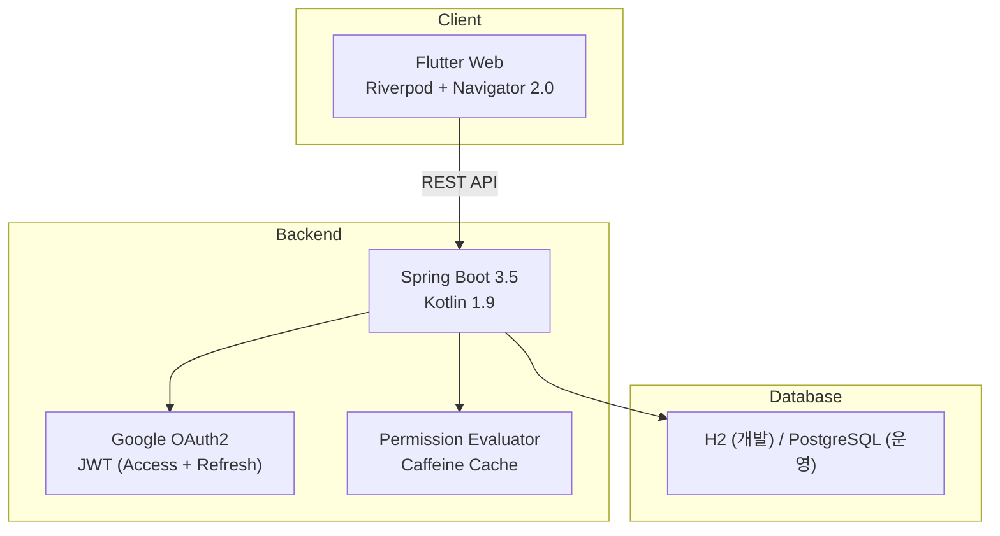

# 대학 그룹 관리 플랫폼

> 학과·동아리·학회를 위한 통합 커뮤니케이션 및 관리 플랫폼

<!--
📸 스크린샷 추가 예정

-->

## 프로젝트 소개

대학에서는 하나의 학과 안에서도 공지는 카카오톡, 모집은 구글 폼, 일정은 엑셀, 회의록은 노션으로 흩어져 있습니다. 동아리나 학회를 운영하는 입장에서는 "우리 그룹만의 공간"이 없어서, 매번 새 단톡방을 만들거나 플랫폼을 옮겨야 합니다.

이 프로젝트는 **대학의 조직 구조(대학 → 단과대 → 학과 → 동아리/학회)를 그대로 반영한 통합 플랫폼**입니다. 그룹마다 워크스페이스가 자동 생성되고, 채널별로 권한을 세분화할 수 있으며, 모집·일정관리·장소예약까지 하나의 플랫폼에서 처리합니다.

백엔드(Spring)만 공부하다가 프론트엔드를 처음 시도해 본 첫 풀스택 프로젝트입니다.

---

## 주요 기능

### 1. 대학 조직 구조를 반영한 그룹 계층

대학의 실제 조직 구조를 시스템에 그대로 매핑했습니다.

```
한신대학교
├── AI/SW 대학 (단과대)
│   └── AI/SW 학부 (학과)
│       ├── AI 학회 (공식 그룹)
│       ├── 프로그래밍 동아리 (자율 그룹)
│       └── 캡스톤 프로젝트팀 (자율 그룹)
└── 공과대학
    └── ...
```

그룹 유형은 6가지(대학, 단과대, 학과, 연구실, 공식, 자율)이며, **각 그룹은 독립적으로 운영**됩니다. 상위 그룹이 하위 그룹의 내부 활동(채널, 게시글, 멤버)을 감시하거나 통제할 수 없고, 유일하게 "하위 그룹 생성 승인/거절"만 가능합니다.

<!--
📸 스크린샷 추가 예정: 그룹 목록 또는 그룹 계층 화면

-->

→ [그룹 시스템 상세 설계](docs/portfolio/features.md#1-그룹-계층-구조)

### 2. 워크스페이스 & 채널 기반 커뮤니케이션

그룹이 승인되면 **워크스페이스가 자동 생성**되고, 기본 2개 채널(공지, 자유게시판)이 템플릿으로 만들어집니다. 그룹장은 필요에 따라 채널을 추가할 수 있습니다:

```
프로그래밍 동아리 워크스페이스
├── 📢 공지사항 (그룹장만 글 작성)
├── 💬 자유게시판 (전체 멤버 작성)
├── 💻 웹개발팀 (팀원만 조회/작성)
└── 📱 앱개발팀 (팀원만 조회/작성)
```

새 채널은 **Secure by Default** 원칙에 따라 권한 0으로 시작합니다. 그룹장이 명시적으로 "이 역할은 이 채널에서 무엇을 할 수 있다"를 설정해야 접근이 가능합니다.

<!--
📸 스크린샷 추가 예정: 워크스페이스 & 채널 화면

-->

→ [워크스페이스 & 채널 상세](docs/portfolio/features.md#2-워크스페이스--채널)

### 3. 2-Layer 권한 시스템 (RBAC + 채널별 오버라이드)

"같은 멤버인데 공지 채널에서는 읽기만, 자유게시판에서는 글쓰기 가능" — 이 요구사항을 해결하기 위해 2계층 권한 모델을 설계했습니다.

**1계층 — 시스템 역할 (그룹 단위)**: 그룹장(모든 권한), 교수(그룹장 동급), 멤버(기본 참여)

**2계층 — 채널 역할 바인딩 (채널 단위)**: 각 역할이 각 채널에서 어떤 권한(조회/읽기/쓰기/댓글/파일)을 갖는지 개별 설정합니다. 커스텀 역할(운영진, 모집담당 등)도 생성 가능합니다.

이 구조에서 가장 고민했던 것은 **권한 체크 성능**이었습니다. 멤버 수백 명이 채널 여러 개에 접근할 때마다 DB를 조회하면 N+1 문제가 발생하므로, Caffeine 캐시를 도입하여 최대 2번의 DB 조회로 모든 권한 판단을 완료하도록 설계했습니다.

<!--
📸 스크린샷 추가 예정: 권한 설정 화면

-->

→ [권한 시스템 상세 설계](docs/portfolio/features.md#3-2-layer-권한-시스템)
→ [N+1 문제 해결 과정](docs/portfolio/technical-challenges.md#1-권한-확인할-때마다-db를-12번-찌르고-있었다)

### 4. 게시글 & 댓글 (Optimistic UI + 읽은 위치 추적)

채널 내에서 게시글을 작성하고, 2단계 댓글(게시글 댓글 → 대댓글)로 토론합니다.

- **게시글 고정(Pin)** — 중요 공지를 상단에 고정합니다.
- **읽은 위치 기억** — 다시 들어오면 마지막으로 읽은 게시글 위치에서 시작합니다.
- **Optimistic UI** — 글 작성 시 서버 응답 전에 즉시 화면에 반영하며, 실패하면 롤백합니다.

이 기능을 Clean Architecture(Domain → Data → Presentation)로 전면 재구성하면서, 기존 코드 대비 관심사 분리와 테스트 커버리지를 크게 개선했습니다.

<!--
📸 스크린샷 추가 예정: 게시글 & 댓글 화면

-->

→ [게시글/댓글 상세](docs/portfolio/features.md#4-게시글--댓글)
→ [Optimistic UI 구현 과정](docs/portfolio/technical-challenges.md#5-서버-응답을-안-기다린다고)

### 5. 캘린더 3종 (개인 / 그룹 / 장소예약)

일정 관리를 3개 레이어로 분리하여, 개인 스케줄과 그룹 활동이 충돌 없이 공존하도록 설계했습니다.

| 캘린더 | 용도 | 주요 기능 |
|--------|------|----------|
| **개인 캘린더** | 시간표, 개인 일정 | 주간/월간 뷰, 반복 일정 |
| **그룹 캘린더** | 동아리/학회 행사 | 공식/비공식 이벤트, RSVP, 대상 지정 |
| **장소 캘린더** | 강의실/동아리방 예약 | 운영시간 설정, 예약 충돌 방지, 차단 시간 |

특히 **장소 예약 시스템**은 요일별 운영시간, 공휴일 차단, 관리자 이전 등 실제 대학 환경에서 필요한 세부 기능까지 설계했습니다.

<!--
📸 스크린샷 추가 예정: 캘린더 화면

-->

→ [캘린더 시스템 상세](docs/portfolio/features.md#5-캘린더-3종-개인--그룹--장소예약)

### 6. 모집 시스템

동아리/학회가 새 멤버를 모집할 때의 전체 워크플로우를 시스템화했습니다.

```
그룹장: 모집 공고 작성 (마감일, 정원 설정)
    ↓
학생: 모집 공고 확인 → 지원서 제출
    ↓
그룹장: 지원서 검토 → 승인/거절 (피드백 포함)
    ↓
승인 시: 학생이 자동으로 그룹 멤버에 추가
```

그룹당 활성 모집은 1개만 가능하고, 학생은 하나의 모집에 1회만 지원할 수 있습니다(철회 후 재지원 가능). 마감 시 자동 종료되며 아카이브로 이동합니다.

<!--
📸 스크린샷 추가 예정: 모집 화면

-->

→ [모집 시스템 상세](docs/portfolio/features.md#6-모집-시스템)

---

## 아키텍처

### 시스템 전체 구조



### 기술적으로 가장 신경 쓴 부분

**Clean Architecture 재설계** — 프로젝트가 커지면서 기존 모놀리식 백엔드(`backend/`)의 한계를 느끼고, `backend_new/`에서 6개 도메인으로 Bounded Context를 나눈 Clean Architecture를 설계했습니다. 29개 Entity, 52개 API, 155개 테스트를 작성하고 7단계 마이그레이션 전략까지 수립했습니다. 기존 백엔드에 완전히 통합하지는 못했지만, "모놀리식 → 도메인 분리"를 직접 경험하면서 아키텍처 설계 역량이 크게 성장한 과정이었습니다.

**Navigator 2.0 마이그레이션** — Flutter의 명령형 네비게이션(Navigator 1.0)에서 선언형(Navigator 2.0)으로 전환하면서, 그룹 간 전환 시 발생하는 상태 꼬임 문제를 해결했습니다. Spring에서는 `@GetMapping`이면 끝나는 라우팅이 프론트엔드에서는 이렇게 복잡한 줄 몰랐습니다. 98개 테스트를 작성하며 권한 기반 폴백, 딥링크, 히스토리 보존 등의 엣지 케이스를 검증했습니다.

**프론트엔드 디자인 시스템 실험** — UI 일관성 문제를 해결하기 위해 `frontend_new/`에서 디자인 토큰 + 39개 재사용 컴포넌트를 만드는 실험을 했습니다. 비즈니스 로직이 있는 앱은 아니고 컴포넌트 라이브러리 쇼케이스입니다.

→ [아키텍처 상세](docs/portfolio/architecture.md)
→ [기술적 도전](docs/portfolio/technical-challenges.md)

---

## 기술 스택

| 분류 | 기술 |
|------|------|
| **Frontend** | Flutter 3.9 (Web), Riverpod, Navigator 2.0, go_router |
| **Backend** | Spring Boot 3.5, Kotlin 1.9, JPA/Hibernate |
| **인증** | Google OAuth 2.0, JWT (Access + Refresh Token) |
| **DB** | H2 (개발), PostgreSQL (운영) |
| **캐시** | Caffeine Cache (권한 체크 최적화) |
| **테스트** | JUnit 5 (백엔드 155개), Flutter Test (프론트엔드 300+개) |

---

## 프로젝트 구조 & 현재 상태

```
univ_group_management/
├── frontend/          # Flutter Web 앱 (운영)
├── frontend_new/      # 디자인 시스템 실험 (컴포넌트 쇼케이스)
├── backend/           # Spring Boot 백엔드 (운영)
├── backend_new/       # Clean Architecture 재설계 (미통합)
└── docs/              # 설계 문서 140+개
```

| 디렉토리 | 상태 | 설명 |
|----------|------|------|
| `frontend/` | ✅ 운영 | 104개 페이지/위젯, 300+ 테스트 |
| `backend/` | ✅ 운영 | 17개 Controller, REST API |
| `backend_new/` | 🔬 실험 | 6 도메인 Clean Architecture, 155 테스트 |
| `frontend_new/` | 🔬 실험 | 39개 컴포넌트 디자인 시스템 |

---

## 개발 마일스톤 (분기 이력)

프로젝트가 진행되면서 크게 3번의 방향 전환이 있었습니다. git tag로도 기록되어 있습니다.

```
v0.1-backend-foundation          v0.2-workspace-launch          v0.3-clean-arch-migration
         │                                │                                │
43d28d8 ──────────── 978e4ae ─────────── c6fe39c ──────────── 71d2a92 ───► 현재 (014 브랜치)
  │                      │                   │                    │
  │                      │                   │                    └── backend_new/ 도입
  │                      │                   │                        Clean Architecture
  │                      │                   │                        6 도메인 분리
  │                      │                   │                        frontend: CA 전환
  │                      │                   │
  │                      │                   └── feat(004): 공지 관리 기능
  │                      │                       PR #32 머지
  │                      │
  │                      └── feat: 워크스페이스 채널/권한 시스템
  │                           그룹 계층 구조 완성
  │                           플러터 로그인 구현
  │
  └── chore: Spring Boot 초기 설정
       로그인 API 초안
```

### 분기 상세

| 태그 | 시점 | 무슨 변화였나 |
|------|------|--------------|
| `v0.1-backend-foundation` | 프로젝트 시작 | Spring Boot 세팅 + Google OAuth + 그룹/멤버 API 기초 설계 |
| `v0.2-workspace-launch` | 워크스페이스 오픈 | 채널·권한·게시글·댓글 1차 구현. Flutter 로그인부터 워크스페이스 화면까지 연결. 백엔드만 하다가 처음으로 풀스택으로 동작하는 순간 |
| `v0.3-clean-arch-migration` | 아키텍처 전환 결정 | 코드가 커지면서 backend_new/ 에 Clean Architecture 재설계 시작. 동시에 Flutter 프론트도 Feature-first + Clean Arch로 전환. 기존 코드와 공존하면서 점진적 마이그레이션 전략 수립 |
| `v0.4-design-system` | 디자인 시스템 실험 | UI 일관성 문제로 frontend_new/ 에서 디자인 토큰 + 컴포넌트 라이브러리 실험. 비즈니스 앱은 아니고 쇼케이스 |
| `v1.0-current` | 현재 (2026.03) | 모든 파일 추적 시작, 전체 코드베이스 정리 완료 |

→ [프로젝트 변천사 상세](docs/portfolio/development-journey.md)

---

## 시작 가이드

### 사전 요구사항

- Flutter SDK 3.9+
- Java 17+
- Google OAuth 2.0 Client ID

### 실행

```bash
# Backend
cd backend
./gradlew bootRun

# Frontend
cd frontend
cp .env.example .env  # Google OAuth Client ID 설정
flutter run -d chrome --web-hostname localhost --web-port 5173
```

---

## 개발 정보

- **개발 기간**: 2025년 9월 ~ 12월 (4개월)
- **개발 인원**: 1명 (기획·설계·프론트엔드·백엔드·문서화)
- **커밋**: 605+
- **설계 문서**: 140+개

---

## 상세 문서

| 문서 | 내용 |
|------|------|
| [기능 상세](docs/portfolio/features.md) | 각 기능의 워크플로우, 유저 시나리오, 설계 의도 |
| [아키텍처 상세](docs/portfolio/architecture.md) | 시스템 구조, 설계 결정, 도메인 분리 |
| [기술적 도전](docs/portfolio/technical-challenges.md) | 실제 부딪힌 8가지 문제와 해결 과정 |
| [기술 선택과 회고](docs/portfolio/decisions.md) | 17가지 기술 결정의 근거, 대안 비교, 회고 |
| [프로젝트 변천사](docs/portfolio/development-journey.md) | 4개월간의 프로젝트 진화 이야기 |
