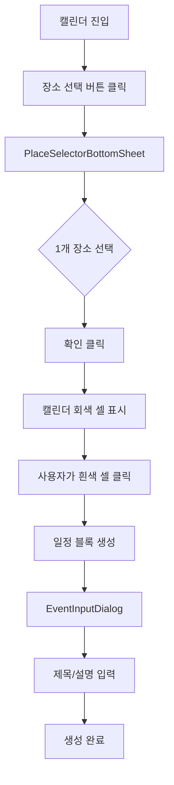
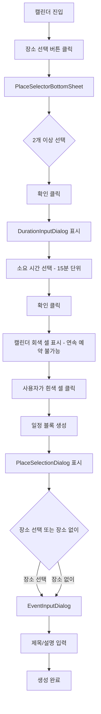

# 데모 캘린더 장소 예약 통합 기능 명세서

> **작성일**: 2025-10-20
> **상태**: Phase 1 완료 (문서화)
> **관련 문서**:
> - [장소 캘린더 상세 명세서](./place-calendar-specification.md)
> - [장소 관리 개념](../concepts/calendar-place-management.md)
> - [캘린더 통합 로드맵](./calendar-integration-roadmap.md)

---

## 📋 목차

1. [개요](#개요)
2. [핵심 기능](#핵심-기능)
3. [사용자 플로우](#사용자-플로우)
4. [UI/UX 설계](#uiux-설계)
5. [기술 설계](#기술-설계)
6. [API 명세](#api-명세)
7. [데이터 모델](#데이터-모델)
8. [알고리즘 상세](#알고리즘-상세)
9. [구현 로드맵](#구현-로드맵)

---

## 개요

### 목적
데모 캘린더(DemoCalendarPage)에 **장소 예약 시스템**을 통합하여, 사용자가 그룹 일정 생성 시 장소를 함께 예약할 수 있도록 합니다.

### 핵심 요구사항
1. **장소 선택**: 사용자가 접근 가능한 모든 장소 표시 (테스트 단계)
2. **예약 가능 시간 표시**:
   - **단일 장소**: 운영시간 외, 기존 예약, 휴무 시간을 회색으로 표시
   - **다중 장소**: 소요 시간만큼 연속으로 예약 가능한 시간만 활성화
3. **일정 생성**: 장소 선택 또는 "장소 없이 생성" 옵션 제공

### 설계 결정사항 요약

| 항목 | 결정 사항 |
|------|-----------|
| **회색 셀 표현** | 단순 회색 배경 (#E0E0E0) |
| **실시간 동기화** | 낙관적 업데이트 (충돌 시 롤백) |
| **에러 메시지** | 상세 ("운영시간 외입니다 (9:00~18:00)") |
| **성능 우선순위** | 인터랙션 반응성 (Lazy Loading) |
| **소요 시간 입력** | 15분 단위 선택 (0.5~8시간) |
| **단일 장소** | 소요 시간 입력 없음, 기존 방식 유지 |

---

## 핵심 기능

### 1. 장소 선택 시스템

#### 1.1 장소 목록 조회
- **API**: `GET /api/places/accessible`
- **응답**: 사용자가 접근 가능한 모든 장소 (테스트용)
- **그룹화**: 건물별 (Building.name)
- **정렬**: 건물명 오름차순 → 장소명 오름차순

#### 1.2 선택 모드
- **단일 선택**: 1개 장소만 선택 가능
- **다중 선택**: 2개 이상 선택 가능 (최대 제한 없음)

### 2. 예약 가능 시간 표시

#### 2.1 단일 장소 선택 시

**회색 셀 조건** (OR 조건):
1. **운영시간 외**: `OperatingHour` 기준
2. **휴무일**: `ClosedDay` (주간 반복)
3. **임시 휴무**: `TemporaryClosedDate` (특정 날짜)
4. **기존 예약**: `PlaceReservation` 존재

**예시**:
```
장소: 공학관 101호
운영시간: 09:00~18:00
휴무일: 토요일, 일요일
기존 예약: 13:00~15:00

→ 회색 셀: 00:00~09:00, 13:00~15:00, 18:00~24:00, 토요일 전체, 일요일 전체
```

#### 2.2 다중 장소 선택 시 (⭐ 핵심 로직)

**소요 시간 입력**:
- 장소 2개 이상 선택 후 즉시 모달 표시
- 15분 단위 선택 (0.5시간 ~ 8시간)
- 확인 버튼 클릭 시 캘린더에 반영

**회색 셀 조건**:
- 선택한 **모든 장소에서** 소요 시간만큼 **연속으로 예약 불가능**한 시간

**알고리즘**:
```
for each 30분 time slot:
  가능한_장소_수 = 0

  for each 선택된_장소:
    if 해당_시간부터_소요시간만큼_연속_예약_가능:
      가능한_장소_수++

  if 가능한_장소_수 == 0:
    회색 처리
  else:
    흰색 처리 (클릭 가능)
```

**예시**:
```
소요 시간: 2시간
장소 A: 1~3시 예약됨
장소 B: 2~4시 예약됨

→ 10시 셀 클릭 시 (10~12시 블록):
  - 장소 A: 10~12시 연속 예약 가능? ✅
  - 장소 B: 10~12시 연속 예약 가능? ✅
  → 흰색 (클릭 가능)

→ 1시 셀 클릭 시 (1~3시 블록):
  - 장소 A: 1~3시 연속 예약 가능? ❌ (1~3시 예약됨)
  - 장소 B: 1~3시 연속 예약 가능? ❌ (2~4시 예약됨, 1~3시 중 2~3시 불가)
  → 회색 (클릭 불가)

→ 4시 셀 클릭 시 (4~6시 블록):
  - 장소 A: 4~6시 연속 예약 가능? ✅
  - 장소 B: 4~6시 연속 예약 가능? ✅
  → 흰색 (클릭 가능)
```

### 3. 일정 생성 플로우

#### 3.1 흰색 셀 클릭 → 일정 블록 생성
- 드래그하여 시간 범위 설정 가능
- 회색 셀이 포함되면 자동으로 제외

#### 3.2 장소 선택 모달 표시 (다중 장소 선택 시)
- **조건**: 장소 2개 이상 선택한 상태에서 일정 블록 생성
- **내용**: 해당 시간대에 실제로 예약 가능한 장소 리스트
- **옵션**: "장소 없이 생성" 체크박스

**API**: `POST /api/places/available-at`
```json
{
  "placeIds": [1, 2, 3],
  "startDateTime": "2025-10-20T10:00:00",
  "endDateTime": "2025-10-20T12:00:00"
}
```

**응답**:
```json
{
  "availablePlaces": [
    {
      "id": 1,
      "name": "공학관 101호",
      "capacity": 30,
      "building": "공학관"
    },
    {
      "id": 3,
      "name": "본관 세미나실",
      "capacity": 50,
      "building": "본관"
    }
  ]
}
```

#### 3.3 세부 정보 입력
- 기존 `EventInputDialog` 사용
- 제목, 설명 입력
- 선택한 장소 정보 포함

---

## 사용자 플로우

### 단일 장소 플로우



### 다중 장소 플로우



---

## UI/UX 설계

### 1. PlaceSelectorBottomSheet

**위치**: 캘린더 상단 "장소 선택" 버튼 클릭 시

**레이아웃**:
```
┌─────────────────────────────────────┐
│  장소 선택                      ✕   │
├─────────────────────────────────────┤
│  🔍 검색 (선택 사항)               │
├─────────────────────────────────────┤
│  📍 공학관 (3)                      │
│    □ 공학관 101호 (30명)          │
│    ✓ 공학관 201호 (50명)          │
│    □ 공학관 세미나실 (20명)       │
│                                     │
│  📍 본관 (2)                        │
│    ✓ 본관 회의실 (40명)           │
│    □ 본관 강당 (200명)            │
├─────────────────────────────────────┤
│     [취소]            [확인]        │
└─────────────────────────────────────┘
```

**동작**:
- 체크박스: 다중 선택 가능
- 확인 버튼 클릭:
  - 1개 선택 → 즉시 캘린더로 복귀
  - 2개 이상 선택 → `DurationInputDialog` 표시

### 2. DurationInputDialog (신규)

**조건**: 장소 2개 이상 선택 시에만 표시

**레이아웃**:
```
┌─────────────────────────────────────┐
│  소요 시간 선택                 ✕   │
├─────────────────────────────────────┤
│                                     │
│  일정의 예상 소요 시간을 선택하세요 │
│                                     │
│  ┌─────────────────────────────┐   │
│  │  1시간 30분         ▼       │   │
│  └─────────────────────────────┘   │
│                                     │
│  • 30분 단위로 선택 가능            │
│  • 선택한 시간만큼 연속으로          │
│    예약 가능한 시간만 표시됩니다     │
│                                     │
├─────────────────────────────────────┤
│              [확인]                 │
└─────────────────────────────────────┘
```

**옵션 (15분 단위)**:
- 15분 (0.25시간)
- 30분 (0.5시간)
- 45분 (0.75시간)
- 1시간
- 1시간 15분
- ...
- 8시간

**동작**:
- Dropdown 또는 NumberPicker 사용
- 확인 클릭 → 모달 닫힘 → 캘린더 회색 셀 재계산

### 3. 캘린더 회색 셀 표시

**단일 장소**:
```
   09:00  10:00  11:00  12:00  13:00  14:00  15:00
┌──────┬──────┬──────┬──────┬──────┬──────┬──────┐
│ ████ │      │      │      │ ████ │ ████ │      │
└──────┴──────┴──────┴──────┴──────┴──────┴──────┘
  운영    예약   예약   예약   기존   기존   예약
  시간    가능   가능   가능   예약   예약   가능
  외
```

**다중 장소 (소요 시간: 2시간)**:
```
   09:00  10:00  11:00  12:00  13:00  14:00  15:00
┌──────┬──────┬──────┬──────┬──────┬──────┬──────┐
│      │      │ ████ │ ████ │ ████ │      │      │
└──────┴──────┴──────┴──────┴──────┴──────┴──────┘
  A,B   A,B    A만    둘다   B만    A,B    A,B
  2시간  2시간  불가   불가   불가   2시간  2시간
  연속   연속                       연속   연속
  가능   가능                       가능   가능
```

**회색 셀 클릭 시**:
- Toast 메시지 표시
- **단일 장소**: "운영시간 외입니다 (9:00~18:00)" 또는 "이미 예약된 시간입니다"
- **다중 장소**: "선택한 시간만큼 연속 예약 불가능합니다 (소요 시간: 2시간)"

### 4. PlaceSelectionDialog (신규)

**조건**: 다중 장소 선택 상태에서 일정 블록 생성 시

**레이아웃**:
```
┌─────────────────────────────────────┐
│  장소 선택                      ✕   │
├─────────────────────────────────────┤
│  10:00 ~ 12:00 (2시간)             │
│                                     │
│  예약 가능한 장소:                  │
│                                     │
│  ○ 공학관 101호                     │
│     수용 인원: 30명                 │
│                                     │
│  ○ 본관 세미나실                    │
│     수용 인원: 50명                 │
│                                     │
│  ☐ 장소 없이 생성                   │
│                                     │
├─────────────────────────────────────┤
│     [취소]            [확정]        │
└─────────────────────────────────────┘
```

**동작**:
- 라디오 버튼: 1개만 선택 가능
- "장소 없이 생성" 체크박스: 선택 시 라디오 버튼 비활성화
- 확정 클릭 → `EventInputDialog` 표시 (선택한 장소 정보 포함)

### 5. EventInputDialog (기존)

**추가 필드**:
- 선택한 장소 정보 표시 (읽기 전용)
- 또는 "장소 없음" 표시

---

## 기술 설계

### 1. 상태 관리 (DemoCalendarPage)

```dart
class DemoCalendarPage extends StatefulWidget {
  // ...
}

class _DemoCalendarPageState extends State<DemoCalendarPage> {
  // 기존 상태
  List<GroupDto> _selectedGroups = [];
  Map<DateTime, List<GroupEventDto>> _groupEvents = {};

  // 신규 상태 (장소 관련)
  List<PlaceDto> _selectedPlaces = [];
  Duration? _requiredDuration; // 다중 장소 선택 시 소요 시간
  Map<int, PlaceAvailabilityDto> _placeAvailability = {}; // placeId → 예약 가능 정보
  Set<DateTime> _disabledSlots = {}; // 회색 셀 시간대

  // 메서드
  Future<void> _loadPlaces() async { /* ... */ }
  Future<void> _loadPlaceAvailability(List<int> placeIds, DateTime date) async { /* ... */ }
  void _calculateDisabledSlots() { /* ... */ }
  Future<void> _showDurationInputDialog() async { /* ... */ }
  Future<void> _showPlaceSelectionDialog(DateTime start, DateTime end) async { /* ... */ }
}
```

### 2. 데이터 모델

#### PlaceDto
```dart
class PlaceDto {
  final int id;
  final String name;
  final int capacity;
  final String buildingName;
  final String? description;

  PlaceDto({
    required this.id,
    required this.name,
    required this.capacity,
    required this.buildingName,
    this.description,
  });

  factory PlaceDto.fromJson(Map<String, dynamic> json) {
    return PlaceDto(
      id: json['id'],
      name: json['name'],
      capacity: json['capacity'],
      buildingName: json['building']['name'],
      description: json['description'],
    );
  }
}
```

#### PlaceAvailabilityDto
```dart
class PlaceAvailabilityDto {
  final int placeId;
  final DateTime date;
  final List<OperatingHourDto> operatingHours;
  final List<PlaceReservationDto> reservations;
  final List<ClosedDayDto> closedDays;
  final List<TemporaryClosedDateDto> temporaryClosedDates;

  // 헬퍼 메서드
  bool isAvailableAt(DateTime time) {
    // 운영시간, 휴무일, 임시 휴무, 기존 예약 체크
    // ...
  }

  bool isAvailableForDuration(DateTime start, Duration duration) {
    // 시작 시간부터 duration만큼 연속으로 예약 가능한지 체크
    DateTime current = start;
    final end = start.add(duration);

    while (current.isBefore(end)) {
      if (!isAvailableAt(current)) {
        return false;
      }
      current = current.add(Duration(minutes: 30)); // 30분 단위 체크
    }
    return true;
  }
}
```

### 3. API 클라이언트

#### PlaceApiClient
```dart
class PlaceApiClient {
  final String baseUrl;
  final String? token;

  // 접근 가능한 모든 장소 조회
  Future<List<PlaceDto>> getAccessiblePlaces() async {
    final response = await http.get(
      Uri.parse('$baseUrl/api/places/accessible'),
      headers: {'Authorization': 'Bearer $token'},
    );

    if (response.statusCode == 200) {
      final List<dynamic> data = json.decode(utf8.decode(response.bodyBytes));
      return data.map((json) => PlaceDto.fromJson(json)).toList();
    }
    throw Exception('Failed to load places');
  }

  // 특정 날짜의 장소 예약 가능 정보 조회
  Future<PlaceAvailabilityDto> getPlaceAvailability(int placeId, DateTime date) async {
    final dateStr = DateFormat('yyyy-MM-dd').format(date);
    final response = await http.get(
      Uri.parse('$baseUrl/api/places/$placeId/availability?date=$dateStr'),
      headers: {'Authorization': 'Bearer $token'},
    );

    if (response.statusCode == 200) {
      return PlaceAvailabilityDto.fromJson(json.decode(utf8.decode(response.bodyBytes)));
    }
    throw Exception('Failed to load availability');
  }

  // 다중 장소 캘린더 조회 (최적화)
  Future<Map<int, PlaceAvailabilityDto>> getMultiplePlaceAvailability(
    List<int> placeIds,
    DateTime date,
  ) async {
    final dateStr = DateFormat('yyyy-MM-dd').format(date);
    final response = await http.post(
      Uri.parse('$baseUrl/api/places/availability'),
      headers: {
        'Authorization': 'Bearer $token',
        'Content-Type': 'application/json',
      },
      body: json.encode({
        'placeIds': placeIds,
        'date': dateStr,
      }),
    );

    if (response.statusCode == 200) {
      final Map<String, dynamic> data = json.decode(utf8.decode(response.bodyBytes));
      return data.map((key, value) => MapEntry(
        int.parse(key),
        PlaceAvailabilityDto.fromJson(value),
      ));
    }
    throw Exception('Failed to load availabilities');
  }

  // 특정 시간대에 예약 가능한 장소 조회
  Future<List<PlaceDto>> getAvailablePlacesAt(
    List<int> placeIds,
    DateTime startDateTime,
    DateTime endDateTime,
  ) async {
    final response = await http.post(
      Uri.parse('$baseUrl/api/places/available-at'),
      headers: {
        'Authorization': 'Bearer $token',
        'Content-Type': 'application/json',
      },
      body: json.encode({
        'placeIds': placeIds,
        'startDateTime': startDateTime.toIso8601String(),
        'endDateTime': endDateTime.toIso8601String(),
      }),
    );

    if (response.statusCode == 200) {
      final Map<String, dynamic> data = json.decode(utf8.decode(response.bodyBytes));
      final List<dynamic> places = data['availablePlaces'];
      return places.map((json) => PlaceDto.fromJson(json)).toList();
    }
    throw Exception('Failed to load available places');
  }
}
```

---

## API 명세

### 1. GET /api/places/accessible

**목적**: 사용자가 접근 가능한 모든 장소 조회 (테스트용)

**요청**:
```http
GET /api/places/accessible HTTP/1.1
Authorization: Bearer {token}
```

**응답**:
```json
[
  {
    "id": 1,
    "name": "공학관 101호",
    "capacity": 30,
    "building": {
      "id": 1,
      "name": "공학관"
    },
    "description": "중형 강의실"
  },
  {
    "id": 2,
    "name": "공학관 201호",
    "capacity": 50,
    "building": {
      "id": 1,
      "name": "공학관"
    },
    "description": "대형 강의실"
  }
]
```

**상태 코드**:
- `200 OK`: 성공
- `401 Unauthorized`: 인증 실패

---

### 2. GET /api/places/{placeId}/availability

**목적**: 특정 날짜의 장소 예약 가능 정보 조회

**요청**:
```http
GET /api/places/1/availability?date=2025-10-20 HTTP/1.1
Authorization: Bearer {token}
```

**응답**:
```json
{
  "placeId": 1,
  "date": "2025-10-20",
  "operatingHours": [
    {
      "dayOfWeek": "MONDAY",
      "openTime": "09:00",
      "closeTime": "18:00"
    }
  ],
  "reservations": [
    {
      "id": 10,
      "startDateTime": "2025-10-20T13:00:00",
      "endDateTime": "2025-10-20T15:00:00",
      "title": "세미나"
    }
  ],
  "closedDays": [
    {
      "dayOfWeek": "SATURDAY"
    },
    {
      "dayOfWeek": "SUNDAY"
    }
  ],
  "temporaryClosedDates": [
    {
      "date": "2025-10-25",
      "reason": "시설 점검"
    }
  ]
}
```

**상태 코드**:
- `200 OK`: 성공
- `404 Not Found`: 장소 없음
- `401 Unauthorized`: 인증 실패

---

### 3. POST /api/places/availability (신규, 최적화용)

**목적**: 다중 장소의 예약 가능 정보를 한 번에 조회

**요청**:
```http
POST /api/places/availability HTTP/1.1
Authorization: Bearer {token}
Content-Type: application/json

{
  "placeIds": [1, 2, 3],
  "date": "2025-10-20"
}
```

**응답**:
```json
{
  "1": {
    "placeId": 1,
    "date": "2025-10-20",
    "operatingHours": [...],
    "reservations": [...],
    "closedDays": [...],
    "temporaryClosedDates": [...]
  },
  "2": {
    "placeId": 2,
    "date": "2025-10-20",
    "operatingHours": [...],
    "reservations": [...],
    "closedDays": [...],
    "temporaryClosedDates": [...]
  },
  "3": {
    "placeId": 3,
    "date": "2025-10-20",
    "operatingHours": [...],
    "reservations": [...],
    "closedDays": [...],
    "temporaryClosedDates": [...]
  }
}
```

**장점**:
- N개 장소 조회 시 1번의 API 호출로 처리
- 네트워크 오버헤드 감소
- 백엔드에서 병렬 처리 가능

**상태 코드**:
- `200 OK`: 성공
- `400 Bad Request`: 잘못된 요청 (placeIds 비어있음)
- `401 Unauthorized`: 인증 실패

---

### 4. POST /api/places/available-at (신규)

**목적**: 특정 시간대에 예약 가능한 장소 목록 조회

**요청**:
```http
POST /api/places/available-at HTTP/1.1
Authorization: Bearer {token}
Content-Type: application/json

{
  "placeIds": [1, 2, 3],
  "startDateTime": "2025-10-20T10:00:00",
  "endDateTime": "2025-10-20T12:00:00"
}
```

**응답**:
```json
{
  "availablePlaces": [
    {
      "id": 1,
      "name": "공학관 101호",
      "capacity": 30,
      "building": {
        "id": 1,
        "name": "공학관"
      },
      "description": "중형 강의실"
    },
    {
      "id": 3,
      "name": "본관 세미나실",
      "capacity": 50,
      "building": {
        "id": 2,
        "name": "본관"
      },
      "description": "세미나실"
    }
  ]
}
```

**상태 코드**:
- `200 OK`: 성공 (빈 배열도 성공)
- `400 Bad Request`: 잘못된 요청
- `401 Unauthorized`: 인증 실패

---

## 알고리즘 상세

### 1. 회색 셀 계산 (단일 장소)

```dart
Set<DateTime> _calculateDisabledSlotsForSinglePlace(
  PlaceAvailabilityDto availability,
  DateTime viewDate,
) {
  final disabledSlots = <DateTime>{};

  // 하루를 30분 단위로 나눔 (48개 슬롯)
  for (int hour = 0; hour < 24; hour++) {
    for (int minute = 0; minute < 60; minute += 30) {
      final slot = DateTime(viewDate.year, viewDate.month, viewDate.day, hour, minute);

      if (!availability.isAvailableAt(slot)) {
        disabledSlots.add(slot);
      }
    }
  }

  return disabledSlots;
}
```

### 2. 회색 셀 계산 (다중 장소 + 소요 시간)

```dart
Set<DateTime> _calculateDisabledSlotsForMultiplePlaces(
  Map<int, PlaceAvailabilityDto> availabilities,
  Duration requiredDuration,
  DateTime viewDate,
) {
  final disabledSlots = <DateTime>{};

  // 하루를 30분 단위로 나눔 (48개 슬롯)
  for (int hour = 0; hour < 24; hour++) {
    for (int minute = 0; minute < 60; minute += 30) {
      final slot = DateTime(viewDate.year, viewDate.month, viewDate.day, hour, minute);

      // 이 시간부터 소요 시간만큼 예약 가능한 장소가 있는지 확인
      bool hasAvailablePlace = false;

      for (final availability in availabilities.values) {
        if (availability.isAvailableForDuration(slot, requiredDuration)) {
          hasAvailablePlace = true;
          break;
        }
      }

      if (!hasAvailablePlace) {
        disabledSlots.add(slot);
      }
    }
  }

  return disabledSlots;
}
```

### 3. 연속 예약 가능 여부 확인

```dart
bool isAvailableForDuration(DateTime start, Duration duration) {
  DateTime current = start;
  final end = start.add(duration);

  // 30분 단위로 체크
  while (current.isBefore(end)) {
    // 1. 운영시간 체크
    if (!_isWithinOperatingHours(current)) {
      return false;
    }

    // 2. 휴무일 체크
    if (_isClosedDay(current)) {
      return false;
    }

    // 3. 임시 휴무 체크
    if (_isTemporarilyClosed(current)) {
      return false;
    }

    // 4. 기존 예약 체크
    if (_isReserved(current)) {
      return false;
    }

    current = current.add(Duration(minutes: 30));
  }

  return true;
}
```

### 4. 특정 시간대 예약 가능 장소 필터링

```dart
Future<List<PlaceDto>> _filterAvailablePlaces(
  List<PlaceDto> selectedPlaces,
  DateTime startDateTime,
  DateTime endDateTime,
) async {
  final availablePlaces = <PlaceDto>[];

  for (final place in selectedPlaces) {
    final availability = _placeAvailability[place.id];
    if (availability == null) continue;

    final duration = endDateTime.difference(startDateTime);
    if (availability.isAvailableForDuration(startDateTime, duration)) {
      availablePlaces.add(place);
    }
  }

  return availablePlaces;
}
```

---

## 구현 로드맵

### Phase 1: 문서화 ✅ (1시간)
- [x] 기능 명세서 작성
- [x] 사용자 플로우 정의
- [x] API 명세 및 데이터 모델 정의
- [x] 알고리즘 상세 설계

### Phase 2: 백엔드 API 추가 (선택, 2시간)
- [ ] `POST /api/places/availability` 구현 (다중 장소 최적화)
- [ ] `POST /api/places/available-at` 구현 (예약 가능 장소 필터링)
- [ ] 기존 `GET /api/places/{placeId}/availability` 검증

### Phase 3: 프론트엔드 핵심 구현 (8-10시간)
- [ ] `PlaceSelectorBottomSheet` 컴포넌트 구현
- [ ] `DurationInputDialog` 컴포넌트 구현
- [ ] `PlaceSelectionDialog` 컴포넌트 구현
- [ ] 회색 셀 계산 로직 구현 (단일/다중 분기)
- [ ] `EventInputDialog` 장소 선택 통합
- [ ] 상태 관리 및 API 연동

### Phase 4: 테스트 및 최적화 (4-6시간)
- [ ] 단일 장소 시나리오 테스트
- [ ] 다중 장소 + 소요 시간 시나리오 테스트
- [ ] 15분 단위 연속 예약 검증
- [ ] 낙관적 업데이트 롤백 테스트
- [ ] Lazy Loading 성능 검증
- [ ] 에러 처리 및 사용자 피드백 개선

### 예상 소요 시간
- **총 15-19시간** (백엔드 포함 시)
- **총 13-17시간** (프론트엔드만)

---

## 추가 고려사항

### 1. 성능 최적화
- **Lazy Loading**: 장소 선택 시에만 API 호출
- **캐싱**: 장소 목록 5분 캐싱, 예약 데이터 주간 단위 캐싱
- **Debouncing**: 소요 시간 변경 시 300ms 디바운싱
- **메모이제이션**: 회색 셀 계산 결과 캐싱

### 2. 에러 처리
- **네트워크 에러**: "장소 정보를 불러올 수 없습니다. 다시 시도해주세요."
- **예약 충돌**: "선택한 시간에 이미 예약이 있습니다. 다른 시간을 선택해주세요."
- **타임아웃**: 5초 타임아웃, 자동 재시도

### 3. 접근성
- **키보드 네비게이션**: Tab, Enter, Esc 키 지원
- **스크린 리더**: Semantics로 의미 전달
- **색상 대비**: WCAG AA 기준 충족 (회색 #E0E0E0, 텍스트 #000000)

### 4. 향후 확장
- **그룹별 필터링**: 실제 운영 시 PlaceUsageGroup 기반 필터링
- **즐겨찾기**: 자주 사용하는 장소 즐겨찾기
- **실시간 동기화**: WebSocket으로 실시간 예약 상태 반영
- **반복 일정**: 매주 반복 일정 시 장소 자동 예약

---

## 참조

- [장소 캘린더 상세 명세서](./place-calendar-specification.md)
- [장소 관리 개념](../concepts/calendar-place-management.md)
- [캘린더 통합 로드맵](./calendar-integration-roadmap.md)
- [프론트엔드 개발 가이드](../implementation/frontend-guide.md)
- [백엔드 개발 가이드](../implementation/backend-guide.md)
