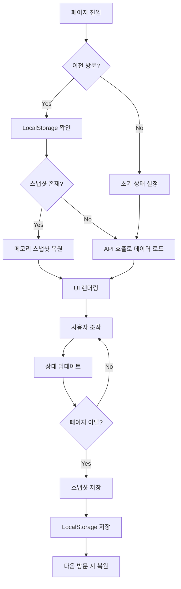

# 상태 지속성 패턴 분석: 워크스페이스 vs 홈/캘린더

## 문서 개요

**작성일**: 2025-10-12
**목적**: 워크스페이스의 상태 관리 및 뒤로가기 로직을 분석하여 홈/캘린더 페이지에 적용하기 위한 설계 문서

**현상 분석**:
- **워크스페이스**: 페이지 이탈 후 복귀 시 상태 유지, 뒤로가기 시 이전 동작 기억
- **홈/캘린더**: 페이지 이탈 시 초기 상태로 리셋, 히스토리 미보존

---

## 1. 워크스페이스 상태 관리 아키텍처

### 1.1 핵심 컴포넌트

```dart
// 3계층 상태 관리 시스템
WorkspaceStateNotifier (StateNotifier)
  ├─ WorkspaceState (현재 상태)
  ├─ WorkspaceSnapshot (그룹별 캐시)
  └─ LocalStorage (영구 저장)
```

#### 계층 1: WorkspaceState (실시간 상태)
```dart
class WorkspaceState extends Equatable {
  // 선택된 엔티티
  final String? selectedGroupId;
  final String? selectedChannelId;
  final String? selectedPostId;

  // UI 상태
  final bool isCommentsVisible;
  final WorkspaceView currentView;  // channel, groupHome, calendar, groupAdmin, etc.
  final MobileWorkspaceView mobileView;  // channelList, channelPosts, postComments

  // 히스토리 관리
  final List<String> channelHistory;  // 채널 탐색 히스토리 (웹 전용)
  final WorkspaceView? previousView;  // 특수 뷰에서 돌아갈 이전 뷰

  // 반응형 상태
  final bool isNarrowDesktopCommentsFullscreen;  // Narrow desktop 모드

  // 데이터
  final List<Channel> channels;
  final Map<String, int> unreadCounts;
  final ChannelPermissions? channelPermissions;

  // 로딩/에러
  final bool isLoadingWorkspace;
  final bool isLoadingChannels;
  final bool isLoadingPermissions;
  final String? errorMessage;
}
```

**주요 특징**:
- **55개 필드**를 통한 세밀한 상태 관리
- Equatable 사용으로 변경 감지 최적화
- copyWith 패턴으로 불변성 보장

#### 계층 2: WorkspaceSnapshot (그룹별 캐싱)
```dart
class WorkspaceSnapshot {
  final WorkspaceView view;
  final MobileWorkspaceView mobileView;
  final String? selectedChannelId;
  final String? selectedPostId;
  final bool isCommentsVisible;
  final bool isNarrowDesktopCommentsFullscreen;
  final WorkspaceView? previousView;
  final List<String> channelHistory;
}

class WorkspaceStateNotifier {
  // 메모리 내 그룹별 스냅샷 캐시
  final Map<String, WorkspaceSnapshot> _workspaceSnapshots = {};
  String? _lastGroupId;
}
```

**저장 시점**:
```dart
// 1. 그룹 전환 시
void enterWorkspace(String groupId) {
  if (!isSameGroup && state.selectedGroupId != null) {
    _saveCurrentWorkspaceSnapshot();  // 이전 그룹 상태 저장
  }
}

// 2. 페이지 dispose 시
@override
void dispose() {
  _workspaceNotifier.cacheCurrentWorkspaceState();  // 현재 상태 캐시
}
```

**복원 시점**:
```dart
// 그룹 재진입 시 자동 복원
final snapshot = _getSnapshot(groupId);
if (snapshot != null) {
  _applySnapshot(snapshot);  // 이전 상태 복원
}
```

#### 계층 3: LocalStorage (영구 저장)
```dart
void _saveToLocalStorage() {
  LocalStorage.instance.saveLastGroupId(state.selectedGroupId);
  LocalStorage.instance.saveLastChannelId(state.selectedChannelId);
  LocalStorage.instance.saveLastViewType(state.currentView.name);
}

Future<void> restoreFromLocalStorage() async {
  final lastGroupId = await LocalStorage.instance.getLastGroupId();
  final lastChannelId = await LocalStorage.instance.getLastChannelId();
  final lastViewType = await LocalStorage.instance.getLastViewType();

  if (lastGroupId != null) {
    await enterWorkspace(lastGroupId, channelId: lastChannelId);
    // 뷰 타입 복원...
  }
}
```

**저장 시점**:
- 채널 선택 시 (`selectChannel`)
- 워크스페이스 종료 시 (`exitWorkspace`)
- 스냅샷 저장 시 (`_saveCurrentWorkspaceSnapshot`)

**복원 시점**:
- 앱 시작 시 (main.dart)
- 워크스페이스 탭 재진입 시

---

### 1.2 상태 전환 플로우



---

## 2. NavigationController와 탭별 히스토리 관리

### 2.1 NavigationController 구조

```dart
class NavigationState {
  final String currentRoute;
  final NavigationTab currentTab;  // home, workspace, calendar, activity, profile
  final bool isWorkspaceCollapsed;
  final Map<NavigationTab, List<NavigationEntry>> tabHistories;  // 핵심!
  final LayoutMode layoutMode;
}

class NavigationEntry {
  final String route;
  final Map<String, dynamic>? context;  // 페이지 복원에 필요한 컨텍스트
}
```

**핵심 메커니즘**: 각 탭마다 독립적인 히스토리 스택 유지

### 2.2 탭별 히스토리 관리 예시

```dart
// 사용자 동작 시나리오
홈 탭 진입 → 그룹 탐색 → 캘린더 탭 → 홈 탭 복귀

// NavigationController 내부 상태 변화
{
  home: [
    NavigationEntry(route: '/home'),
    NavigationEntry(route: '/home/group-explore', context: {tab: 0}),
  ],
  calendar: [
    NavigationEntry(route: '/calendar'),
  ],
  workspace: [],
  ...
}

// 홈 탭에서 뒤로가기 시
goBack() → {
  home: [NavigationEntry(route: '/home')],  // 마지막 항목 제거
  ...
} → 그룹 탐색에서 홈 대시보드로 복귀
```

### 2.3 NavigationController의 저장/복원

```dart
void navigateTo(String route, {Map<String, dynamic>? context}) {
  final tab = NavigationTab.fromRoute(route);
  final newEntry = NavigationEntry(route: route, context: context);

  // 탭별 히스토리에 추가
  final currentTabHistory = List<NavigationEntry>.from(
    state.tabHistories[tab] ?? [],
  );
  currentTabHistory.add(newEntry);

  state = state.copyWith(
    currentRoute: route,
    currentTab: tab,
    tabHistories: {
      ...state.tabHistories,
      tab: currentTabHistory,
    },
  );

  // LocalStorage에 현재 탭 인덱스 저장
  _saveCurrentTabIndex();
}
```

**복원 로직**:
```dart
Future<void> restoreLastTab() async {
  final lastTabIndex = await LocalStorage.instance.getLastTabIndex();
  if (lastTabIndex != null) {
    final tab = NavigationTab.values[lastTabIndex];
    navigateToTabRoot(tab);
  }
}
```

---

## 3. 뒤로가기 처리 로직

### 3.1 PopScope 기반 계층적 처리

워크스페이스는 **3단계 뒤로가기 우선순위**를 구현:

```dart
Widget build(BuildContext context) {
  return PopScope(
    canPop: !canHandleBack,
    onPopInvokedWithResult: (didPop, result) {
      if (!didPop) {
        _handleBackPressForMode(layoutMode);
      }
    },
    child: ...,
  );
}
```

#### 우선순위 1: 특수 뷰 종료
```dart
bool handleWebBack() {
  // groupAdmin, memberManagement, calendar 등에서 channel 뷰로 복귀
  if (state.currentView != WorkspaceView.channel && state.previousView != null) {
    state = state.copyWith(
      currentView: state.previousView,
      previousView: null,
    );
    return true;  // 내부 처리
  }
  // ... 다음 우선순위로
}
```

#### 우선순위 2: 댓글 패널 닫기
```dart
bool handleWebBack() {
  // ...
  if (state.isCommentsVisible) {
    hideComments();
    return true;
  }
  // ... 다음 우선순위로
}
```

#### 우선순위 3: 채널 히스토리 탐색
```dart
bool handleWebBack() {
  // ...
  if (state.channelHistory.isNotEmpty) {
    final newHistory = List<String>.from(state.channelHistory);
    final previousChannelId = newHistory.removeLast();

    state = state.copyWith(
      selectedChannelId: previousChannelId,
      channelHistory: newHistory,
    );
    loadChannelPermissions(previousChannelId);
    return true;
  }

  return false;  // 시스템 뒤로가기 허용 (홈으로 이동)
}
```

### 3.2 반응형 뒤로가기 처리

```dart
bool _canHandleBackForMode(LayoutMode mode) {
  switch (mode) {
    case LayoutMode.compact:  // 모바일
      return _canHandleMobileBack();
    case LayoutMode.medium:   // 태블릿
      return _canHandleTabletBack();
    case LayoutMode.wide:     // 데스크톱
      return responsive.isNarrowDesktop
          ? _canHandleNarrowDesktopBack()
          : _canHandleWideDesktopBack();
  }
}
```

**모바일 3단계 플로우**:
```dart
bool handleMobileBack() {
  switch (state.mobileView) {
    case MobileWorkspaceView.postComments:
      // Step 3 → Step 2
      state = state.copyWith(mobileView: MobileWorkspaceView.channelPosts);
      return true;
    case MobileWorkspaceView.channelPosts:
      // Step 2 → Step 1
      state = state.copyWith(mobileView: MobileWorkspaceView.channelList);
      return true;
    case MobileWorkspaceView.channelList:
      // Step 1 → 홈으로 (시스템 처리)
      return false;
  }
}
```

---

## 4. 홈/캘린더의 현재 상태

### 4.1 홈 페이지 (home_page.dart)

```dart
// HomeState: 매우 단순한 구조
class HomeState extends Equatable {
  final HomeView currentView;  // dashboard, groupExplore
  final HomeView? previousView;
  final int groupExploreInitialTab;
}

// HomeStateNotifier: 기본적인 뷰 전환만 지원
class HomeStateNotifier extends StateNotifier<HomeState> {
  void showGroupExplore({int initialTab = 0}) {
    state = state.copyWith(
      previousView: state.currentView,
      currentView: HomeView.groupExplore,
      groupExploreInitialTab: initialTab,
    );
  }

  bool handleBack() {
    if (state.currentView == HomeView.groupExplore) {
      showDashboard();
      return true;
    }
    return false;
  }
}
```

**문제점**:
- 페이지 이탈 시 상태가 보존되지 않음
- 스냅샷 캐싱 없음
- LocalStorage 연동 없음
- NavigationController와의 연동이 약함

### 4.2 캘린더 페이지 (calendar_page.dart)

```dart
// CalendarEventsState: 뷰 상태만 관리
class CalendarEventsState {
  final List<PersonalEvent> events;
  final bool isLoading;
  final CalendarViewType view;  // month, week, day
  final DateTime focusedDate;
  final DateTime selectedDate;
  final bool hasInitialized;  // 초기화 플래그만 존재
}

// TimetableState: 독립적 상태 관리
class TimetableState {
  final List<PersonalSchedule> schedules;
  final bool isLoading;
  final DateTime weekStart;
  final bool hasLoaded;
}
```

**문제점**:
- TabController 상태가 보존되지 않음 (항상 첫 번째 탭으로 리셋)
- 사용자가 선택한 날짜/뷰 모드가 유지되지 않음
- 스크롤 위치 복원 없음
- LocalStorage 연동 없음

---

## 5. 워크스페이스 vs 홈/캘린더 비교

| 기능 | 워크스페이스 | 홈 | 캘린더 |
|------|------------|-----|--------|
| **상태 스냅샷 캐싱** | ✅ 그룹별 메모리 캐시 | ❌ 없음 | ❌ 없음 |
| **LocalStorage 저장** | ✅ 3개 필드 저장 | ❌ 없음 | ❌ 없음 |
| **히스토리 관리** | ✅ 채널 히스토리 스택 | ⚠️ previousView만 | ❌ 없음 |
| **뒤로가기 처리** | ✅ 3단계 우선순위 | ⚠️ 1단계만 | ❌ PopScope 없음 |
| **반응형 전환 처리** | ✅ 웹↔모바일 상태 보존 | ❌ 없음 | ❌ 없음 |
| **dispose 시 캐싱** | ✅ 명시적 호출 | ❌ 없음 | ❌ 없음 |
| **NavigationController 연동** | ✅ enterWorkspace/exitWorkspace | ⚠️ 약함 | ⚠️ 약함 |

---

## 6. 적용 방안 설계

### 6.1 홈 페이지 개선 방안

#### Phase 1: 기본 상태 보존
```dart
// 1. HomeState 확장
class HomeState extends Equatable {
  final HomeView currentView;
  final HomeView? previousView;
  final int groupExploreInitialTab;

  // 추가: 상태 보존을 위한 필드
  final int? groupExploreSelectedTab;  // 사용자가 선택한 탭
  final Map<String, dynamic>? groupExploreScrollPosition;  // 스크롤 위치
  final Map<String, bool>? groupExploreFilters;  // 필터 상태
}

// 2. HomeSnapshot 추가
class HomeSnapshot {
  final HomeView view;
  final int? groupExploreSelectedTab;
  final Map<String, dynamic>? scrollPosition;
  final Map<String, bool>? filters;
}

// 3. HomeStateNotifier 확장
class HomeStateNotifier extends StateNotifier<HomeState> {
  HomeSnapshot? _snapshot;

  void _saveSnapshot() {
    _snapshot = HomeSnapshot(
      view: state.currentView,
      groupExploreSelectedTab: state.groupExploreSelectedTab,
      scrollPosition: state.groupExploreScrollPosition,
      filters: state.groupExploreFilters,
    );
  }

  void _restoreSnapshot() {
    if (_snapshot != null) {
      state = state.copyWith(
        currentView: _snapshot!.view,
        groupExploreSelectedTab: _snapshot!.groupExploreSelectedTab,
        groupExploreScrollPosition: _snapshot!.scrollPosition,
        groupExploreFilters: _snapshot!.filters,
      );
    }
  }
}
```

#### Phase 2: LocalStorage 연동
```dart
// LocalStorage 확장
class LocalStorage {
  // 기존: getLastTabIndex, saveLastTabIndex

  // 추가: 홈 페이지 상태
  Future<String?> getLastHomeView() async {
    final prefs = await SharedPreferences.getInstance();
    return prefs.getString('last_home_view');
  }

  Future<void> saveLastHomeView(String view) async {
    final prefs = await SharedPreferences.getInstance();
    await prefs.setString('last_home_view', view);
  }

  Future<int?> getLastGroupExploreTab() async { ... }
  Future<void> saveLastGroupExploreTab(int tab) async { ... }
}

// HomeStateNotifier에서 사용
void _saveToLocalStorage() {
  LocalStorage.instance.saveLastHomeView(state.currentView.name);
  if (state.currentView == HomeView.groupExplore) {
    LocalStorage.instance.saveLastGroupExploreTab(
      state.groupExploreSelectedTab ?? 0
    );
  }
}

Future<void> restoreFromLocalStorage() async {
  final lastView = await LocalStorage.instance.getLastHomeView();
  if (lastView == 'groupExplore') {
    final lastTab = await LocalStorage.instance.getLastGroupExploreTab();
    showGroupExplore(initialTab: lastTab ?? 0);
  }
}
```

#### Phase 3: NavigationController 통합
```dart
// HomePage dispose 시
@override
void dispose() {
  ref.read(homeStateProvider.notifier).cacheCurrentState();
  super.dispose();
}

// NavigationController에서 탭 전환 시
void navigateTo(String route, {Map<String, dynamic>? context}) {
  // 현재 탭이 홈이고 다른 탭으로 이동할 때
  if (state.currentTab == NavigationTab.home && tab != NavigationTab.home) {
    // 홈 상태 저장 요청
    // (ref.read는 불가능하므로 이벤트 기반 또는 콜백 필요)
  }

  // 기존 로직...
}
```

### 6.2 캘린더 페이지 개선 방안

#### Phase 1: 탭 상태 보존
```dart
// CalendarPageState 추가 (StatefulWidget의 로컬 상태)
class _CalendarPageState extends ConsumerState<CalendarPage>
    with SingleTickerProviderStateMixin {
  late final TabController _tabController;
  static int? _lastTabIndex;  // 정적 변수로 상태 보존

  @override
  void initState() {
    super.initState();
    _tabController = TabController(
      length: 2,
      vsync: this,
      initialIndex: _lastTabIndex ?? 0,  // 이전 탭 복원
    );

    _tabController.addListener(() {
      _lastTabIndex = _tabController.index;  // 탭 변경 시 저장
    });
  }
}
```

#### Phase 2: 뷰 상태 보존
```dart
// CalendarEventsState 확장
class CalendarEventsState {
  // 기존 필드...
  final bool hasInitialized;

  // 추가: 상태 복원 플래그
  final bool isRestoringState;
}

// Provider에 스냅샷 추가
class CalendarEventsNotifier extends StateNotifier<CalendarEventsState> {
  CalendarEventsState? _snapshot;

  void saveSnapshot() {
    _snapshot = CalendarEventsState(
      events: state.events,
      isLoading: false,
      isMutating: false,
      view: state.view,
      focusedDate: state.focusedDate,
      selectedDate: state.selectedDate,
      hasInitialized: state.hasInitialized,
    );
  }

  void restoreSnapshot() {
    if (_snapshot != null && _snapshot!.hasInitialized) {
      state = _snapshot!;
    }
  }
}
```

#### Phase 3: LocalStorage 연동
```dart
// LocalStorage 확장
class LocalStorage {
  Future<String?> getLastCalendarView() async { ... }
  Future<void> saveLastCalendarView(String view) async { ... }

  Future<String?> getLastCalendarDate() async { ... }
  Future<void> saveLastCalendarDate(String isoDate) async { ... }

  Future<int?> getLastCalendarTab() async { ... }
  Future<void> saveLastCalendarTab(int index) async { ... }
}

// CalendarEventsNotifier에서 자동 저장
void changeView(CalendarViewType view) {
  state = state.copyWith(view: view);
  LocalStorage.instance.saveLastCalendarView(view.name);
  loadEvents();
}

void selectDate(DateTime date) {
  final normalized = _normalizeDate(date);
  state = state.copyWith(selectedDate: normalized);
  LocalStorage.instance.saveLastCalendarDate(normalized.toIso8601String());
  loadEvents();
}

// 초기화 시 복원
Future<void> initialize() async {
  if (state.hasInitialized) return;

  // LocalStorage에서 복원
  final lastView = await LocalStorage.instance.getLastCalendarView();
  final lastDateStr = await LocalStorage.instance.getLastCalendarDate();

  if (lastView != null || lastDateStr != null) {
    state = state.copyWith(
      view: lastView != null
          ? CalendarViewType.values.byName(lastView)
          : state.view,
      selectedDate: lastDateStr != null
          ? DateTime.parse(lastDateStr)
          : state.selectedDate,
      hasInitialized: true,
    );
  }

  await loadEvents();
}
```

---

## 7. 구현 우선순위 및 복잡도

### 7.1 홈 페이지

| Phase | 작업 내용 | 복잡도 | 예상 시간 |
|-------|----------|-------|---------|
| 1 | HomeState 확장 + Snapshot 패턴 | 낮음 | 1-2시간 |
| 2 | LocalStorage 연동 | 중간 | 2-3시간 |
| 3 | NavigationController 통합 | 높음 | 3-4시간 |
| 4 | 그룹 탐색 스크롤 위치 보존 | 중간 | 2-3시간 |

**총 예상 시간**: 8-12시간

### 7.2 캘린더 페이지

| Phase | 작업 내용 | 복잡도 | 예상 시간 |
|-------|----------|-------|---------|
| 1 | TabController 상태 보존 | 낮음 | 1-2시간 |
| 2 | CalendarEventsState Snapshot | 중간 | 2-3시간 |
| 3 | TimetableState Snapshot | 중간 | 2-3시간 |
| 4 | LocalStorage 연동 (뷰/날짜/탭) | 중간 | 2-3시간 |

**총 예상 시간**: 7-11시간

---

## 8. 추천 구현 순서

### Step 1: 빠른 개선 (1-2일)
1. **캘린더 TabController 상태 보존** (정적 변수 방식)
2. **홈 previousView 활용 개선** (기존 구조 활용)

### Step 2: 중간 개선 (3-4일)
3. **캘린더 LocalStorage 연동** (뷰/날짜/탭)
4. **홈 LocalStorage 연동** (뷰/그룹 탐색 탭)

### Step 3: 완전한 개선 (5-7일)
5. **홈 Snapshot 패턴 구현**
6. **캘린더 Snapshot 패턴 구현**
7. **NavigationController 통합 강화**

---

## 9. 핵심 패턴 요약

### 워크스페이스에서 배운 3가지 핵심 패턴

#### 패턴 1: 3계층 상태 관리
```dart
// 계층 1: 실시간 상태 (StateNotifier)
StateNotifier<T>

// 계층 2: 메모리 캐시 (Snapshot)
Map<String, Snapshot> _snapshots

// 계층 3: 영구 저장 (LocalStorage)
SharedPreferences
```

#### 패턴 2: dispose 시 자동 캐싱
```dart
@override
void dispose() {
  ref.read(provider.notifier).cacheCurrentState();
  super.dispose();
}
```

#### 패턴 3: 복원 우선순위
```dart
Future<void> initialize() async {
  // 1. 메모리 스냅샷 확인
  if (_snapshot != null) {
    restoreFromSnapshot();
    return;
  }

  // 2. LocalStorage 확인
  final saved = await LocalStorage.instance.getLastState();
  if (saved != null) {
    restoreFromLocalStorage(saved);
    return;
  }

  // 3. 기본 상태로 시작
  loadInitialData();
}
```

---

## 10. 주의사항 및 고려사항

### 10.1 성능 고려사항
- **스냅샷 크기**: 큰 리스트 데이터는 스냅샷에서 제외 (API로 재조회)
- **LocalStorage 용량**: 필수 필드만 저장 (날짜, ID, 플래그)
- **메모리 누수 방지**: 스냅샷 개수 제한 (LRU 캐시 고려)

### 10.2 사용자 경험 고려사항
- **너무 많은 복원은 혼란**: 모든 상태를 복원하기보다 핵심만
- **투명성**: 사용자가 "이전 상태로 돌아왔다"는 것을 인지할 수 있어야 함
- **초기화 옵션**: "처음부터 다시 시작" 버튼 제공

### 10.3 테스트 시나리오
1. **기본 플로우**: 홈 → 다른 탭 → 홈 복귀 (상태 유지 확인)
2. **앱 재시작**: 상태 저장 → 앱 종료 → 재시작 (복원 확인)
3. **오래된 데이터**: 1주일 전 저장된 상태 → 무효화 처리
4. **에러 처리**: LocalStorage 실패 시 기본 상태로 폴백

---

## 11. 다음 단계

### 즉시 시작 가능한 작업
1. **캘린더 TabController 정적 변수 패턴** (1시간)
2. **LocalStorage 확장 메서드 추가** (1시간)

### 설계 검토 필요한 작업
3. **NavigationController 이벤트 시스템 설계**
4. **Snapshot 메모리 관리 정책 수립**

### 문서화 작업
5. **frontend-guide.md 업데이트** (상태 보존 패턴 추가)
6. **워크스페이스 가이드 참조 링크 추가**

---

## 참조

- `frontend/lib/presentation/providers/workspace_state_provider.dart` - 워크스페이스 상태 관리
- `frontend/lib/presentation/pages/workspace/workspace_page.dart` - 뒤로가기 처리
- `frontend/lib/core/navigation/navigation_controller.dart` - 탭별 히스토리 관리
- `frontend/lib/core/services/local_storage.dart` - 영구 저장소
- `docs/implementation/frontend-workspace-guide.md` - 워크스페이스 가이드
- `docs/implementation/frontend-guide.md` - 프론트엔드 가이드
