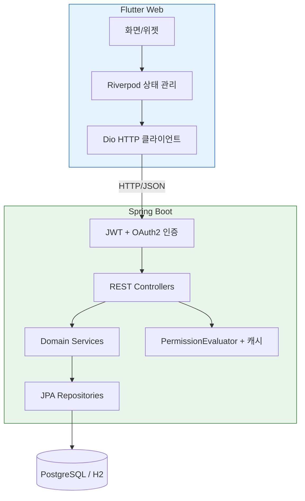
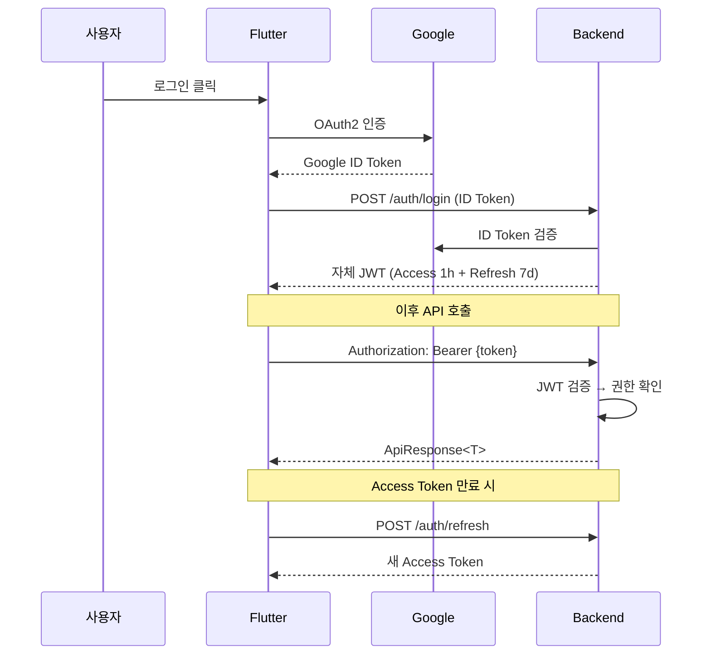
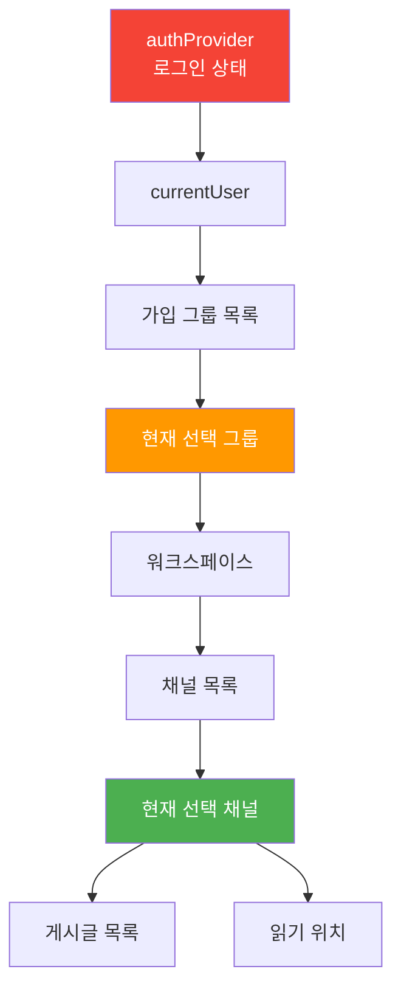

# 아키텍처 상세

시스템의 구조와 각 설계 결정의 이유를 설명합니다. 백엔드는 Spring을 공부하면서 익힌 패턴들을 적용했으며, 프론트엔드는 처음 시도해보면서 시행착오를 거쳐 구조를 확립했습니다.

---

## 전체 구조



사용자가 Flutter 앱에서 동작을 수행하면 Riverpod Provider가 상태를 관리하고, Dio가 백엔드 REST API를 호출합니다. 백엔드에서는 JWT를 검증한 후 권한을 확인하고, 서비스 로직을 거쳐 DB에 접근합니다.

---

## 백엔드: 구조 설계의 근거

### 모놀리식 아키텍처 선택 이유

처음부터 마이크로서비스를 고려했으나, 대학 서비스 규모에서는 과도한 복잡도라고 판단했습니다. 수업에서 마이크로서비스 아키텍처를 배웠으나, 사용자가 수백 명 수준인 프로젝트에 서비스 분리, 메시지 큐, API Gateway를 도입하는 것은 실효성보다 구축 비용이 더 컸습니다.

대신 **도메인별로 패키지를 분리하는 Modular Monolith**를 선택했습니다. 처음에는 Spring에서 흔히 사용하는 기술 계층별 구조(`controller/`, `service/`, `repository/`)로 시작했으나, 기능이 늘어남에 따라 한 패키지에 관련 없는 코드가 섞이기 시작했습니다. 이를 해결하기 위해 도메인별로 패키지를 구성하고 도메인 간 직접 참조를 금지하며, 반드시 Service 인터페이스를 통해 통신하도록 설계했습니다. 향후 분리가 필요할 경우 패키지 단위로 독립시킬 수 있는 구조입니다.

### 6개 도메인

```
User        — 사용자, 프로필
Group       — 그룹, 멤버, 역할, 가입 신청
Permission  — 역할-권한 바인딩, 채널 바인딩
Workspace   — 워크스페이스, 채널, 읽기 위치
Content     — 게시글, 댓글
Calendar    — 일정, 장소 예약 (12개 엔티티)
```

도메인 간 의존 방향은 User ← Group ← Workspace ← Content 순으로 한 방향으로만 흐르도록 설계하여 순환 참조를 방지했습니다. Spring에서 `@Service` 간 순환 참조가 발생하면 빈 생성 자체가 불가능한데, 패키지 수준에서도 동일한 원칙을 적용했습니다.

### API 표준: 통일된 응답 구조

모든 API는 `ApiResponse<T>` 래퍼를 사용합니다. 성공과 실패 여부에 관계없이 프론트엔드에서 항상 동일한 구조로 파싱할 수 있도록 구성했습니다.

```json
{ "success": true,  "data": { ... }, "error": null }
{ "success": false, "data": null,    "error": { "code": "GROUP_NOT_FOUND", "message": "..." } }
```

이러한 설계의 목적은 프론트엔드에서의 에러 처리를 용이하게 하기 위함입니다. 프론트엔드 개발을 처음 진행하며 HTTP 상태 코드(404, 500)만으로는 구체적인 에러 원인을 파악하기 어렵다는 점을 느꼈습니다. `error.code`를 도입함으로써 프론트엔드에서 에러 유형별로 적절한 UI를 제공할 수 있게 되었으며, 이는 직접 프론트엔드를 구현해본 경험을 바탕으로 내린 결정입니다.

---

## 인증 흐름



Google 토큰을 그대로 사용하지 않고 자체 JWT를 발급하는 이유는 **토큰 수명과 클레임을 직접 제어**하기 위해서입니다. 사용자의 그룹 멤버십이나 역할 정보를 토큰에 담아, 매 요청마다 DB를 조회하지 않고도 기본적인 인가 판단이 가능하도록 설계했습니다.

Spring Security의 `JwtAuthenticationFilter`를 구현하여 모든 요청에 대해 토큰 검증을 수행합니다. 수업에서 배운 세션 기반 인증보다 REST API의 특성에 맞는 Stateless한 JWT 방식이 더 적합하다고 판단했습니다.

---

## 권한 시스템

이 프로젝트에서 가장 심혈을 기울인 부분입니다.

### RBAC 모델의 확장 필요성

일반적인 RBAC는 "이 역할은 특정 행위를 할 수 있다"고 정의합니다. Spring Security의 `@PreAuthorize("hasRole('ADMIN')")` 방식이 대표적입니다. 그러나 대학 그룹 환경에서는 동일한 "멤버" 역할이라도 소속된 채널에 따라 권한이 달라져야 하는 요구사항이 있었습니다.

```
공지사항 채널: 멤버 → 읽기 전용
자유게시판:    멤버 → 읽기 및 쓰기 가능
비공개 채널:   멤버 → 접근 불가 (바인딩이 없는 경우 기본 차단)
```

### 2계층 모델 설계

**1계층 (그룹 수준)**: 시스템 역할 3종

| 역할 | 권한 | 특징 |
|------|------|------|
| 그룹장 | 모든 권한 | 수정 및 삭제 불가 (불변) |
| 교수 | 확장 권한 | 공지사항 작성 가능 |
| 멤버 | 채널 바인딩 의존 | 바인딩이 없는 경우 접근 불가 |

**2계층 (채널 수준)**: `ChannelRoleBinding`을 통해 역할별 권한을 채널마다 개별 설정합니다.

핵심 원칙은 **Secure by Default**입니다. 새로 생성된 채널은 기본적으로 아무런 권한이 부여되지 않으며, 명시적으로 바인딩을 추가해야만 접근이 가능합니다. 이는 Spring Security에서 `SecurityFilterChain`의 기본 정책을 `denyAll()`로 설정하는 것과 유사한 개념입니다.

### 성능 최적화

권한 확인은 모든 API 요청마다 발생하므로 성능 확보가 필수적입니다.

**문제**: 단순 구현 시 채널 수에 비례하여 N+1 쿼리가 발생합니다. JPA의 `@OneToMany` 관계를 적절한 처리 없이 사용할 경우 연관 엔티티마다 개별 SELECT 쿼리가 실행되는 문제가 있었습니다.

**해결**: Fetch Join과 2단계 쿼리를 활용하여 항상 2회 이하의 DB 조회로 권한 확인을 완료하도록 개선했습니다. 또한 Caffeine 캐시를 적용하여 동일한 사용자-채널 조합에 대해서는 캐시된 정보를 즉시 반환하도록 했습니다. `@Cacheable` 어노테이션을 통해 캐시 적용 자체는 간편했으나, 데이터 정합성을 위한 캐시 무효화 시점 설정에 신중을 기했습니다.

---

## 프론트엔드: 상태 관리

프론트엔드 개발 과정에서 가장 도전적이었던 영역입니다. Spring에서는 요청에 대해 DB 데이터를 응답하고 종료되는 흐름이 일반적이라 "상태 관리"의 개념이 상대적으로 희박합니다. 반면 프론트엔드에서는 인증 정보, 선택된 그룹 및 채널 상태가 메모리에 유지되며 상호 의존성을 가집니다.

### Provider 의존성 구조



Provider 간 의존 관계는 단방향으로 흐르도록 설계했습니다. `현재 선택 그룹`이 변경되면 하위의 워크스페이스, 채널, 게시글 목록이 자동으로 갱신됩니다. Spring에서 서비스 간 순환 참조를 방지하는 것과 동일한 원리로 의존성 방향을 일관되게 유지했습니다.

인증 로직은 별도의 `AuthRepository`로 분리하여 순환 참조를 차단했습니다. 로그아웃 처리 시 모든 상태를 초기화하는 과정에서 발생했던 순환 참조 문제를 이 구조를 통해 해결했습니다.

### 낙관적 UI 업데이트 (Optimistic UI)

백엔드에서는 "요청, 응답, 결과 표시"가 순차적으로 진행되는 것이 자연스럽습니다. 하지만 프론트엔드에서는 사용자가 네트워크 응답 대기 시간을 직접적으로 체감하게 됩니다. 이를 개선하기 위해 댓글 작성 시 서버의 응답을 기다리지 않고 화면에 즉시 반영하는 Optimistic Update 패턴을 적용했습니다.

```
1. 사용자가 댓글 작성 → 화면에 즉시 표시 (낙관적 반영)
2. 서버로 POST 요청 전송
3-a. 요청 성공 시: 서버로부터 받은 실제 데이터로 상태 갱신
3-b. 요청 실패 시: 화면에서 해당 항목 제거 (롤백 처리)
```

초기에는 서버 검증 전 데이터를 표시하는 것에 대해 의구심이 있었으나, 대부분의 정상 요청 케이스에서 사용자 경험을 극대화하는 것이 프론트엔드 설계의 핵심임을 이해하게 되었습니다. AsyncNotifier를 활용하여 이러한 상태 변경 흐름을 체계적으로 관리하고 있습니다.

---

## 핵심 설계 결정 요약

| 결정 사항 | 선택 내용 | 결정 근거 |
|------|------|------|
| 아키텍처 | Modular Monolith | 대학 규모 서비스에 적합한 효율성 추구 및 도메인 분리로 확장성 확보 |
| 권한 모델 | RBAC + Channel Override | 채널별 세밀한 접근 제어 요구사항 충족 (단순 RBAC의 한계 극복) |
| 네비게이션 | Navigator 2.0 | 딥 링크 지원, 그룹 전환 처리 및 폴백 대응을 위한 선언적 방식 채택 |
| 상태 관리 | Riverpod AsyncNotifier | 비동기 상태(로딩/에러/데이터)의 일관된 처리 및 선언적 상태 관리 |
| API 응답 | ApiResponse\<T\> 래퍼 | 프론트엔드 에러 처리 로직 통일 및 에러 코드 기반 UI 분기 처리 |
| 보안 정책 | Secure by Default | 보안 사고 예방을 위해 새 채널은 명시적 권한 부여 전까지 접근 차단 |
| 전환 전략 | 점진적 3단계 마이그레이션 | 전체 시스템 교체에 따른 리스크 회피 및 Feature Flag를 활용한 안정성 확보 |

---

[← README.md](../../README.md) · [기능 상세](features.md) · [기술 선택과 회고](decisions.md) · [기술적 도전](technical-challenges.md) · [프로젝트 변천사](development-journey.md)
