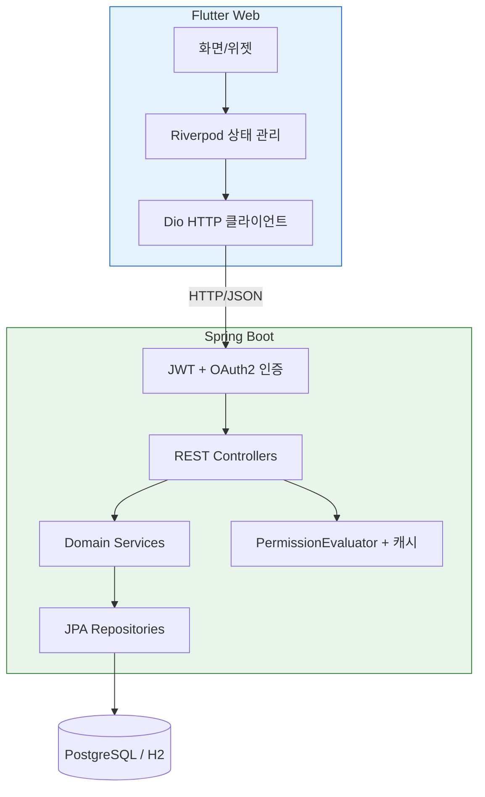
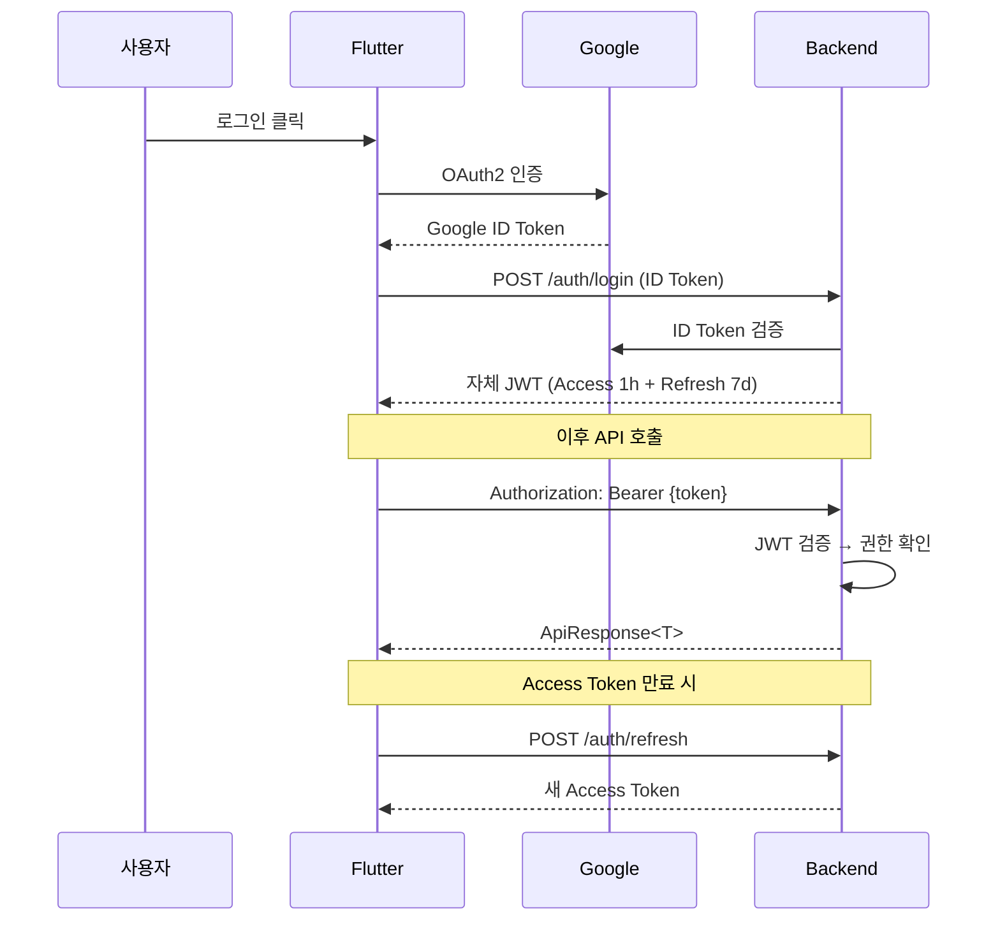
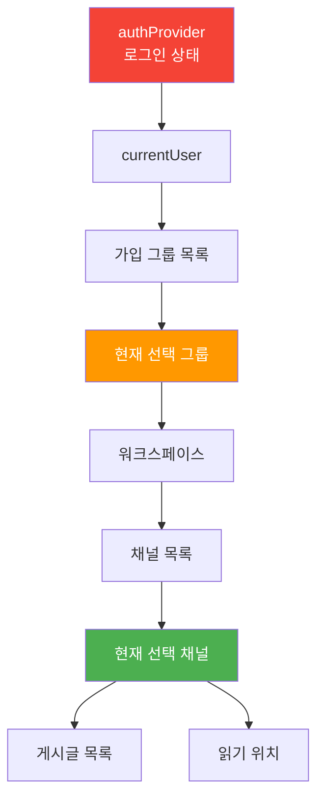

# 아키텍처 상세

시스템의 구조와 각 설계 결정의 이유를 설명한다. 백엔드는 Spring을 공부하면서 익힌 패턴들을 적용했고, 프론트엔드는 처음 해보면서 시행착오를 거쳐 구조를 잡았다.

---

## 전체 구조



사용자가 Flutter 앱에서 동작을 수행하면 Riverpod Provider가 상태를 관리하고, Dio가 백엔드 REST API를 호출한다. 백엔드에서는 JWT를 검증한 후 권한을 확인하고, 서비스 로직을 거쳐 DB에 접근한다.

---

## 백엔드: 왜 이런 구조인가

### 모놀리식에서 시작한 이유

처음부터 마이크로서비스를 고려했지만, 대학 서비스 규모에서는 과도한 복잡도라고 판단했다. 수업에서 마이크로서비스 아키텍처를 배우긴 했는데, 사용자가 수백 명 수준인 프로젝트에 서비스 분리, 메시지 큐, API Gateway를 도입하는 건 배보다 배꼽이 컸다.

대신 **도메인별로 패키지를 분리하는 Modular Monolith**를 선택했다. 처음에는 Spring에서 흔히 쓰는 기술 계층별 구조(`controller/`, `service/`, `repository/`)로 시작했는데, 기능이 늘면서 한 패키지에 관련 없는 코드가 섞이기 시작했다. 그래서 도메인별로 패키지를 잡고, 도메인 간 직접 참조를 금지하고, 반드시 Service 인터페이스를 통해 통신하게 했다. 나중에 분리가 필요하면 패키지 단위로 떼어낼 수 있다.

### 6개 도메인

```
User        — 사용자, 프로필
Group       — 그룹, 멤버, 역할, 가입 신청
Permission  — 역할-권한 바인딩, 채널 바인딩
Workspace   — 워크스페이스, 채널, 읽기 위치
Content     — 게시글, 댓글
Calendar    — 일정, 장소 예약 (12개 엔티티)
```

도메인 간 의존 방향은 한쪽으로만 흐른다: User ← Group ← Workspace ← Content. 순환 참조는 없다. Spring에서 `@Service` 간 순환 참조가 생기면 빈 생성 자체가 안 되는데, 패키지 수준에서도 같은 원칙을 적용한 거다.

### API 표준: 모든 응답이 같은 형태

모든 API가 `ApiResponse<T>` 래퍼를 사용한다. 성공이든 실패든 프론트엔드에서 항상 같은 구조로 파싱할 수 있다.

```json
{ "success": true,  "data": { ... }, "error": null }
{ "success": false, "data": null,    "error": { "code": "GROUP_NOT_FOUND", "message": "..." } }
```

이렇게 한 이유는 프론트엔드 에러 처리를 쉽게 만들기 위해서다. 프론트엔드를 처음 하면서 느낀 건, HTTP 상태 코드(404, 500)만으로는 "어떤 에러인지"를 구분하기 어렵다는 거였다. `error.code`를 넣으니까 프론트엔드에서 에러 유형별로 다른 UI를 보여줄 수 있게 됐다. 이 결정은 내가 직접 프론트엔드를 짜봤기 때문에 나올 수 있었다.

---

## 인증 흐름



Google의 토큰을 그대로 쓰지 않고 자체 JWT를 발급하는 이유는 **토큰 수명과 클레임을 직접 제어**하기 위해서다. 사용자의 그룹 멤버십이나 역할 정보를 토큰에 담아서, 매 요청마다 DB를 조회하지 않아도 기본적인 인가 판단이 가능하다.

Spring Security의 `JwtAuthenticationFilter`를 구현해서 모든 요청에 대해 토큰을 검증한다. 수업에서 세션 기반 인증을 배웠는데, REST API에서는 Stateless한 JWT가 더 적합했다. 서버에 세션을 저장하지 않아도 되니까.

---

## 권한 시스템

이 프로젝트에서 가장 많은 시간을 들인 부분이다.

### 왜 단순 RBAC로는 부족했나

일반적인 RBAC는 "이 역할은 이런 것을 할 수 있다"고 정의한다. Spring Security의 `@PreAuthorize("hasRole('ADMIN')")` 같은 거다. 그런데 대학 그룹에서는 같은 "멤버" 역할이라도 채널에 따라 할 수 있는 일이 달라야 한다.

```
공지사항 채널: 멤버 → 읽기만
자유게시판:    멤버 → 읽기 + 쓰기
비공개 채널:   멤버 → 접근 불가 (바인딩 없으면 기본적으로 차단)
```

### 2계층 모델

**1계층 (그룹 수준)**: 시스템 역할 3종

| 역할 | 권한 | 특징 |
|------|------|------|
| 그룹장 | 모든 것 | 수정/삭제 불가 (불변) |
| 교수 | 확장 권한 | 공지 작성 가능 |
| 멤버 | 채널 바인딩 의존 | 바인딩 없으면 접근 불가 |

**2계층 (채널 수준)**: `ChannelRoleBinding`으로 역할별 권한을 채널마다 설정

핵심 원칙은 **Secure by Default**다. 새로 만든 채널은 아무 권한도 없어서, 명시적으로 바인딩을 추가해야만 접근할 수 있다. Spring Security에서 `SecurityFilterChain`의 기본 정책을 `denyAll()`로 두는 것과 같은 발상이다.

### 성능 최적화

권한 확인은 모든 API 요청마다 일어나므로 성능이 중요하다.

**문제**: 단순 구현 시 채널 수만큼 N+1 쿼리 발생. JPA의 `@OneToMany`를 아무 생각 없이 쓰면 연관 엔티티마다 SELECT가 나간다.

**해결**: Fetch Join + 2단계 쿼리로 항상 2번 이하의 DB 조회로 해결. Caffeine 캐시를 적용해서 같은 사용자-채널 조합은 캐시에서 즉시 반환. `@Cacheable` 한 줄이면 캐시 적용은 쉬운데, 캐시 무효화 시점을 정하는 게 까다로웠다.

---

## 프론트엔드: 상태 관리

프론트엔드를 처음 하면서 가장 어려웠던 부분이다. Spring에서는 "상태 관리"라는 개념 자체가 거의 없다. 요청이 오면 DB에서 꺼내서 응답하면 끝이다. 그런데 프론트엔드에서는 인증, 그룹 선택, 채널 선택 같은 상태가 메모리에 계속 살아 있고, 서로 의존한다.

### Provider 의존성 구조



Provider 간 의존은 단방향이다. `선택 그룹`이 바뀌면 하위의 워크스페이스·채널·게시글이 자동으로 갱신된다. Spring에서 `@Service` 간 순환 참조를 피하는 것과 같은 원리로, 의존 방향을 한쪽으로만 강제했다.

인증 로직은 별도 `AuthRepository`로 분리해서 순환 참조를 끊었다. 로그아웃 시 모든 상태를 초기화하는 과정에서 순환 참조 버그가 터졌었는데, 이 구조로 해결했다.

### 낙관적 UI 업데이트

백엔드에서는 "요청 → 응답 → 결과 표시"가 당연한 흐름이다. 그런데 프론트엔드에서는 사용자가 응답 대기 시간을 체감한다. 그래서 댓글 작성 시 서버 응답을 기다리지 않고 즉시 화면에 추가하는 Optimistic Update 패턴을 적용했다.

```
1. 사용자가 댓글 작성 → 즉시 화면에 표시 (낙관적)
2. 서버에 POST 요청 전송
3-a. 성공 → 서버 응답 데이터로 교체
3-b. 실패 → 화면에서 제거 (롤백)
```

처음에 "서버 확인도 안 하고 보여준다고?" 싶었는데, 대부분의 요청은 성공하니까 사용자 경험을 우선하는 것이 프론트엔드의 사고방식이라는 걸 이해하게 됐다. AsyncNotifier에 이 패턴을 적용해서 상태 변경 흐름을 한 곳에서 관리한다.

---

## 핵심 설계 결정 요약

| 결정 | 선택 | 이유 |
|------|------|------|
| 아키텍처 | Modular Monolith | 대학 규모에 마이크로서비스는 과도, 도메인 분리로 확장성 확보 |
| 권한 | RBAC + Channel Override | 채널별 세밀한 제어 필요, 단순 RBAC 한계 |
| 네비게이션 | Navigator 2.0 | 딥 링크, 그룹 전환, 폴백 처리에 선언적 방식 필수 |
| 상태 관리 | Riverpod AsyncNotifier | 비동기 상태(로딩/에러/데이터)를 일관되게 처리 |
| API 응답 | ApiResponse\<T\> 래퍼 | 프론트엔드 에러 처리 통일, 에러 코드별 UI 분기 |
| 보안 기본값 | Secure by Default | 새 채널은 아무 권한 없이 시작, 명시적으로만 열림 |
| 마이그레이션 | 점진적 3단계 | Big Bang 전환 위험 회피, Feature Flag로 롤백 가능 |

---

[← README.md](../../README.md) · [기능 상세](features.md) · [기술 선택과 회고](decisions.md) · [기술적 도전](technical-challenges.md) · [프로젝트 변천사](development-journey.md)
